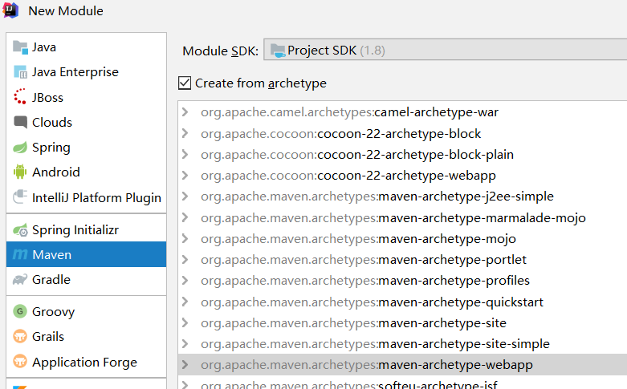

# 项目搭建

## maven-web项目搭建

new module

maven项目，从模板中选择webapp

## maven创建过慢

在创建项目时遇到Maven仓库设置，**添加键值对**：

key  = archetypeCatalog

value = internal

## 选择模块路径

注意是单独的路径

# mvc测试

- 因为是基于Servlet，所以首先配置**web.xml**，设置dispatchservlet的拦截路径
- 其次编写mvc的配置文件
  - 扫描路径
  - 开启扫描
  - 视图解析：比如由"success"映射到  ""/WEB-INF/pages/success.jsp"
  - 设置不拦截静态资源

- 为了打开mvc配置文件，在web.xml